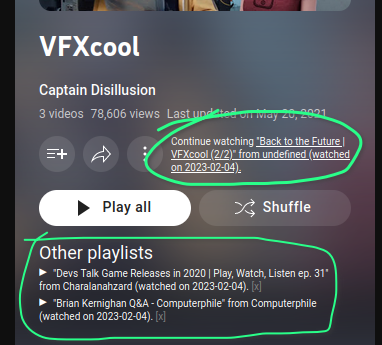

[![Badge showing number of installs from Greasy Fork][GreasyForkInstallsBadge]][greasyfork]

# YouTube playlist playback tracker

Have you ever gone back to a long playlist on YouTube and realized that you'd
forgot which video was your last?  Then this userscript is for you!  This
userscript remembers which video you've watched last in a playlist, so that you
don't have to.

The source code is distributed under the terms of the MIT Licence.  See
[LICENSE.txt](LICENSE.txt) for details.

## How to install

1. To install this userscript in your browser you'll need a browser extension
   for managing userscripts:

   - I recommend [https://www.tampermonkey.net/](https://www.tampermonkey.net/).
   - More options are listed on <https://greasyfork.org/> (section "Step 1:
     install a userscript manager")

2. Once you have a browser extension for userscripts installed, just click on
   button "Install this script" on [Greasy Fork][greasyfork].  The browser
   extension will automagically detect the userscript.

## How it works

After you watch a video in a playlist (URL must contain parameters `list` and
`v`, [example][BackToTheFuture2]) for at least a minute, the userscript will
remember this video for this playlist.  Then, when you later open [the
playlist][VFXcool] again, the script will show you were you've stopped.

[greasyfork]: https://greasyfork.org/en/scripts/459412-youtube-playlists-playback-tracker "Install via Greasy Fork"
[BackToTheFuture2]: https://www.youtube.com/watch?v=rhNDsPMaK_A&list=PLQlvLOFtrgKbQrKzRS_B-UYjEjX10LZNl "Video 'Back to the Future | VFXcool (2/2)' from Captain Disillusion"
[VFXcool]: https://www.youtube.com/playlist?list=PLQlvLOFtrgKbQrKzRS_B-UYjEjX10LZNl "Playlist VFXcool from Captain Disillusion"
[Wikipedia]: https://en.wikipedia.org/wiki/Userscript "English Wikipedia article 'Userscript'"
[GreasyForkInstallsBadge]: https://img.shields.io/badge/dynamic/json?style=flat&color=670000&label=Greasy%20Fork&query=total_installs&suffix=%20installs&url=https%3A%2F%2Fgreasyfork.org%2Fscripts%2F459412.json
